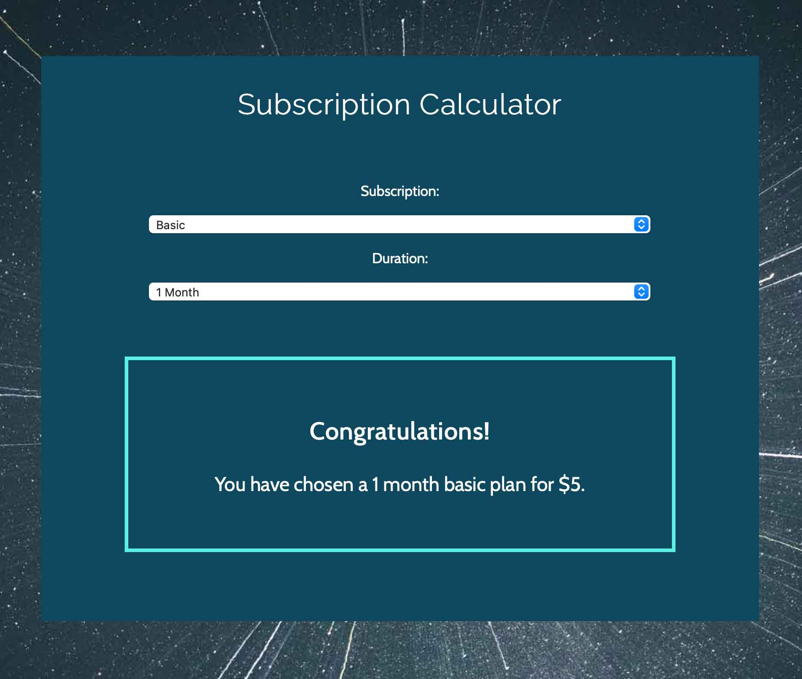

<h1><a href="https://labmandala.github.io/subscription-plan-calculator"><strong>Subscription Plan Calculator</strong></a></h1>

<h2>Objective</h2>

A subscription calculator to provide the user with the cost of plans for different subscription types and durations.

<h4>JavaScript Involved:</h4>

* Change Event Listeners
* Event Handlers
* Function Expressions
* Callback Functions
* Console Logging for checks

The code was written for this project to calculate the numbers and return a message relevant to the selected plan and associated cost.

